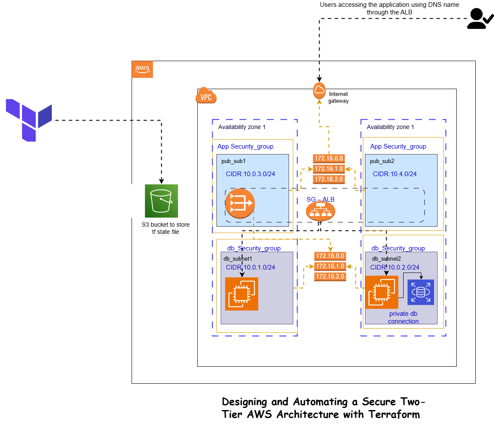

# Two-Tier AWS Architecture with Terraform

A production-ready, secure, and scalable two-tier AWS infrastructure built with Terraform. This architecture implements a web application tier with load balancing, auto-scaling, and a managed database tier with high availability options.

## 🏗️ Architecture Overview

This infrastructure creates:

- **Web Tier**: Auto-scaling EC2 instances behind an Application Load Balancer
- **Database Tier**: Managed MySQL RDS instance in private subnets
- **Networking**: Multi-AZ VPC with public and private subnets
- **Security**: Multi-layered security groups and SSL/TLS encryption
- **Monitoring**: CloudWatch alarms, VPC Flow Logs, and enhanced monitoring



## 📋 Features

### ✅ Security
- 🔐 **Database credentials managed by AWS Secrets Manager**
- 🛡️ **SSL/TLS encryption with automatic HTTP to HTTPS redirect**
- 🔒 **KMS encryption for database and secrets**
- 🚫 **Database in private subnets with no public access**
- 📊 **VPC Flow Logs for network monitoring**
- 🎯 **Layered security groups following principle of least privilege**

### ✅ High Availability
- 🌐 **Multi-AZ deployment across two availability zones**
- 🔄 **Auto Scaling Group with configurable capacity**
- ⚖️ **Application Load Balancer with health checks**
- 💾 **Optional RDS Multi-AZ for database failover**
- 🔗 **Optional multi-AZ NAT Gateways**

### ✅ Monitoring & Observability
- 📈 **CloudWatch alarms for CPU, health, and performance metrics**
- 📝 **Log aggregation for ALB and application logs**
- 🔍 **RDS Enhanced Monitoring and Performance Insights**
- 🚨 **SNS topic for alert notifications**
- 📊 **VPC Flow Logs for network analysis**

### ✅ Best Practices
- 📦 **Infrastructure as Code with Terraform**
- 🔄 **Automated backups with configurable retention**
- 🏷️ **Consistent resource tagging**
- 📤 **Comprehensive outputs for integration**
- ✅ **Input validation on all variables**

## 🚀 Quick Start

### Prerequisites

1. **AWS CLI configured** with appropriate permissions
2. **Terraform installed** (v1.0+)
3. **Domain name** (required for SSL certificate)

### Deployment Steps

1. **Clone and navigate to the repository:**
   ```bash
   git clone <repository-url>
   cd terraform-aws-two-tier
   ```

2. **Create a `terraform.tfvars` file:**
   ```hcl
   region                = "eu-north-1"
   terraform_vpc         = "my-app-vpc"
   vpc_cidr             = "10.0.0.0/16"
   domain_name          = "your-domain.com"
   enable_rds_multi_az  = true     # For production
   enable_multi_az_nat  = true     # For production HA
   ```

3. **Initialize and deploy:**
   ```bash
   terraform init
   terraform plan
   terraform apply
   ```

4. **Configure DNS (required for SSL):**
   - Point your domain to the ALB DNS name (from outputs)
   - Or create DNS validation records as shown in Terraform output

5. **Access your application:**
   - HTTP: `http://your-alb-dns-name` (redirects to HTTPS)
   - HTTPS: `https://your-domain.com`

## 📁 File Structure

```
.
├── 00-providers.tf                     # Terraform and AWS provider configuration
├── 01-vpc.tf                          # VPC creation
├── 02-int-gateway.tf                  # Internet Gateway
├── 03-public-subnet.tf                # Public subnets (AZ-1a, AZ-1b)
├── 04-private-subnet.tf               # Private subnets (AZ-1a, AZ-1b)
├── 05-public-route-table.tf           # Public subnet routing
├── 06-public-route-table-association.tf # Public subnet associations
├── 07-elastic-ip.tf                   # Elastic IP for NAT Gateway
├── 08-nat-gateway.tf                  # NAT Gateway for private egress
├── 09-private-route-table.tf          # Private subnet routing
├── 10-private-route-table-association.tf # Private subnet associations
├── 11-alb-sg.tf                       # Load balancer security group
├── 12-app-sg.tf                       # Application security group
├── 13-db-sg.tf                        # Database security group
├── 15-target-groups.tf                # ALB target groups
├── 17-alb.tf                          # Application Load Balancer
├── 18-listener.tf                     # ALB HTTP/HTTPS listeners
├── 19-launch-template.tf              # EC2 launch template
├── 20-auto-scaling-group.tf           # Auto Scaling Group
├── 21-db-instance.tf                  # RDS MySQL database
├── 21-db-subnet-group.tf              # Database subnet group
├── 22-ssl-certificate.tf              # ACM SSL certificate
├── 23-monitoring.tf                   # CloudWatch monitoring
├── secrets.tf                         # KMS keys and IAM roles
├── variables.tf                       # Input variables
├── outputs.tf                         # Output values
└── README.md                          # This file
```

## ⚙️ Configuration Variables

| Variable | Description | Default | Required |
|----------|-------------|---------|----------|
| `region` | AWS region | `eu-north-1` | No |
| `terraform_vpc` | VPC name prefix | `stanlexy-vpc` | No |
| `vpc_cidr` | VPC CIDR block | `10.0.0.0/16` | No |
| `domain_name` | Domain for SSL certificate | `example.com` | **Yes** |
| `enable_multi_az_nat` | Multi-AZ NAT Gateways | `false` | No |
| `enable_rds_multi_az` | RDS Multi-AZ deployment | `false` | No |

## 📊 Infrastructure Outputs

After deployment, Terraform provides these outputs:

- `alb_dns_name` - Load balancer DNS name
- `vpc_id` - VPC identifier
- `rds_endpoint` - Database endpoint (sensitive)
- `ssl_certificate_arn` - SSL certificate ARN
- `security_group_ids` - Security group mappings

## 🔒 Security Considerations

### Current Security Features:
- ✅ Database credentials in AWS Secrets Manager
- ✅ SSL/TLS encryption with modern cipher suites
- ✅ Database in private subnets only
- ✅ KMS encryption for data at rest
- ✅ VPC Flow Logs enabled
- ✅ Security groups with minimal required access

### Additional Recommendations:
- 🔧 Configure WAF for the Application Load Balancer
- 🔧 Enable GuardDuty for threat detection
- 🔧 Implement AWS Config for compliance monitoring
- 🔧 Use AWS Inspector for vulnerability assessments
- 🔧 Configure CloudTrail for API auditing

## 💰 Cost Optimization

### Current Costs (eu-north-1):
- **ALB**: ~$16/month (always-on)
- **EC2** (t3.micro): ~$6/month per instance
- **RDS** (db.t3.micro): ~$12/month
- **NAT Gateway**: ~$32/month per gateway
- **EBS, networking**: ~$5/month

### Optimization Tips:
- Use `enable_multi_az_nat = false` for development environments
- Consider Reserved Instances for production workloads
- Enable automated start/stop for non-production environments
- Use `enable_rds_multi_az = false` for non-critical environments

## 🔧 Maintenance

### Regular Tasks:
- **Backup Verification**: Ensure RDS backups are completing successfully
- **Security Updates**: Keep AMIs updated with latest security patches
- **Certificate Renewal**: ACM handles automatic renewal
- **Monitoring**: Review CloudWatch alarms and logs regularly

### Scaling:
- **Horizontal**: Increase Auto Scaling Group `max_size` and `desired_capacity`
- **Vertical**: Update `instance_type` in launch template
- **Database**: Modify RDS instance class as needed

## 🚨 Disaster Recovery

### Backup Strategy:
- **RDS**: 7-day automated backup retention
- **Snapshots**: Final snapshot on destroy (configurable)
- **Cross-Region**: Consider cross-region snapshot copying for critical data

### Recovery Procedures:
1. **Database Restore**: Use automated backups or manual snapshots
2. **Infrastructure**: `terraform apply` recreates all resources
3. **Data Recovery**: Restore from RDS backups to new instance

## 🔍 Troubleshooting

### Common Issues:

#### SSL Certificate Validation Fails
```bash
# Check DNS records
dig your-domain.com

# Verify ACM certificate status
aws acm describe-certificate --certificate-arn <cert-arn>
```

#### Auto Scaling Group Not Working
```bash
# Check launch template
aws ec2 describe-launch-templates

# Review Auto Scaling activities
aws autoscaling describe-scaling-activities --auto-scaling-group-name <asg-name>
```

#### Database Connection Issues
```bash
# Test connectivity from EC2 instance
mysql -h <rds-endpoint> -u admin -p

# Check security groups
aws ec2 describe-security-groups --group-ids <sg-id>
```

## 🤝 Contributing

1. Fork the repository
2. Create a feature branch
3. Make your changes
4. Test with `terraform plan`
5. Submit a pull request

## 📄 License

This project is licensed under the MIT License - see the LICENSE file for details.

## 🙋‍♀️ Support

For questions or issues:
1. Check the troubleshooting section
2. Review AWS documentation
3. Open an issue in this repository

---

**⚠️ Important**: Always review the planned changes with `terraform plan` before applying to production environments.